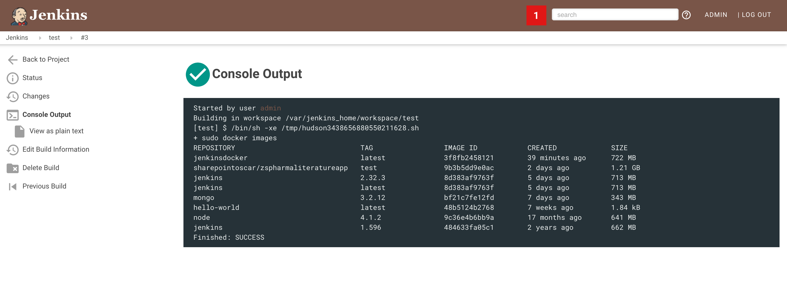

## A DOCKERFILE TO SPIN UP A JENKINS CONTAINER CONFIGURED TO USE HOST MACHINE CLI (Docker-outside-of-Docker)  
Concept from Adrian Mouat's [article](http://container-solutions.com/running-docker-in-jenkins-in-docker)

***

## Overview
Like many other nerds out there, I wanted to enhance my  CI/CD configuration and have the ability to build Docker images on successful app build and testing.  In order to do that, Jenkins needs the ability to execute Docker CLI commands.  Enter this approach, otherwise knowwn as DooD ()

## My Setup
I am running Docker on my Macbook Pro, I've chosen to install it using the homebrew vs. downloading the dmg.  This allows me to keep things updated and neat.

## Build the Docker Image
``$ docker build -t sharepointoscar/jenkins .``

## Create Docker Container
This command ensures that the host machine docker installation is accessible to the container we are about to run.
``$ docker -it run -d -v /var/run/docker.sock:/var/run/docker.sock \``
        ``-v $(which docker):/usr/bin/docker -v $PWD/JenkinsHome:/var/jenkins_home -p 8080:666 jenkins``

(twitter: sharepointoscar)
